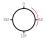
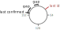

# Introduction

With ggwave alone we can have lost packets double-transmissions.
The ggcom protocol is a data message oriented (not stream oriented) transmission protocol that builds upon ggwave and adds message loss detection, retransmission and dounble-transmission rejection on top of ggwave.

The idea is to send messages that stand on their own and can be processed immediately without waiting for re-transmission of earlier missed messages.
In the context of the line printer, each line is in one message an we draw the line as soon as we receive it.
Lost messages will first show up as gaps in the printout.
When we detect a gap, we request the missing messages and re-draw the missing lines.

It is intended to be used with a receiving arduino so the memory and processing constraints are very tight.

## GGCom Protocol

The GGCom protocol uses increasing packets ids to detect lost packets.
When the current received packet id is not the increment of the previous packet id, we know that we missed a packet.
Since we only have a finite set of packet ids (eg. 255) we need to reuse them in a sensible way.
When we reach the maximum packet id, we start again at 0.
We therefore can imagine the packet ids on a circle where we move around in a circle when drawing new ids:

The sender keeps track of the last packet id it sent and the last packet id up to wich the receiver has confirmed reception of all previous packets.
This specifies a range of packet ids that are sent but not yet confirmed:

Within this range, the sender has to keep the sent packets in memory for potential re-transmission.
Also, when drawing new packet ids, the sender must not draw packet ids within this range.
In case the id pool is exhausted (last sent id is just before the last confirmed id), the sender must wait until the receiver confirms reception of the last sent packet before sending new packets.
In this case, instead of sending the data packet, it will send a request for the missing packets and the last confirmed packet id.

The receiver keeps track of the last received packet id for message loss detection and a list of gaps in the transmission.
When a message is received, it either 
1. succeds the last message (everything is fine)
2. more than succeeds the last message (we missed messages -> store gap)
3. falls in a previously stored gap (we received a missing message -> remove/resize gap)
4. is a pointless re-transmission of a message we already received (ignore)

There are the following message types:

**Sent by sender** | semantics | intention | when to send
--- | --- | --- | ---
`t<id><message>` | here is a message with an id | transfer a message | application needs to send a message
`?a000...` | did you miss messages? up to what id did you receive all messages properly? | figure out what messages can be cleared from the cache and what ids can be re-used when sending | id pool is exhausted OR chunk of messages has been sent (defined by the application layer)
`?r000...` | start new connection | receiver should forget about all lost packets and start fresh | on startup or when the receiver acts strange
`?r<id>` | I missed messages up to
**Sent by receiver** | | | 
`<id1><id2>` | I missed messages between id1 and id2 (excluding id2) | request re-transmission | after we got a `?a` message or after after a timeout since the last received message AND we are still missing messages
`<id><id>` | I received all messages up to id | let sender purge cache | after the sender stopped sending for a while OR we received a `?a` message

## GGWave Protocol Settings

For best compatibility between the python version of ggwave and the arduino version it:
- does not use DSS
- uses the DT_FASTEST protocol (which is protocolId=8 on the python end)
- uses fixed length packets

## Future Work
Idea: Harmonic Quantization?
